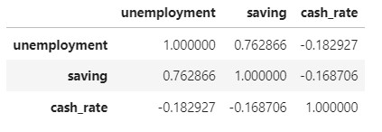
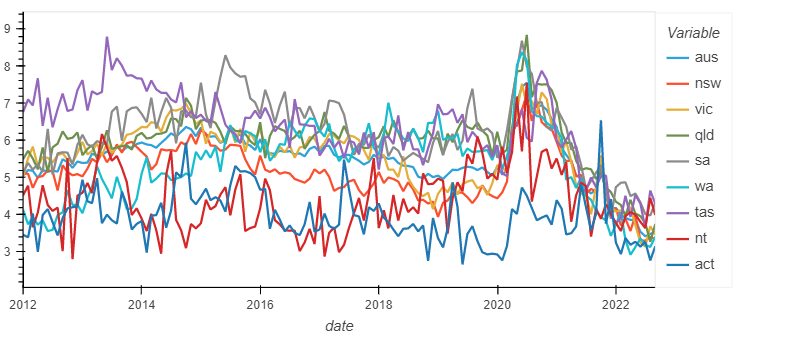
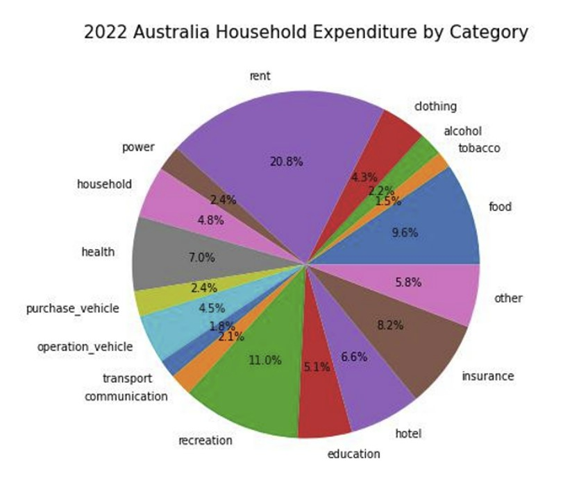
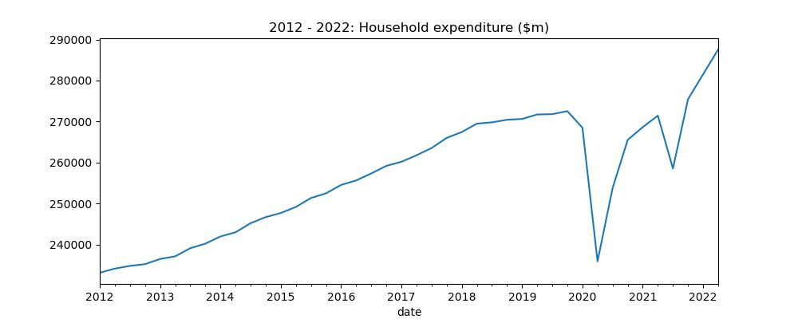
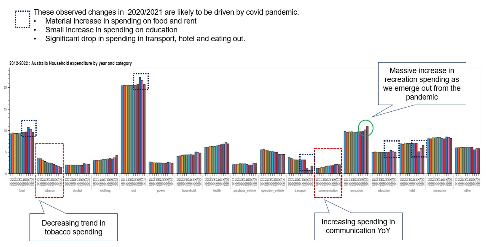
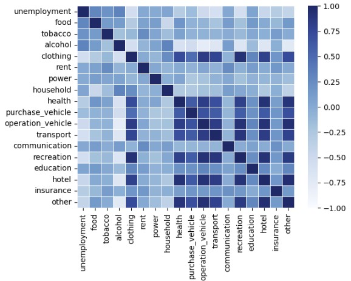
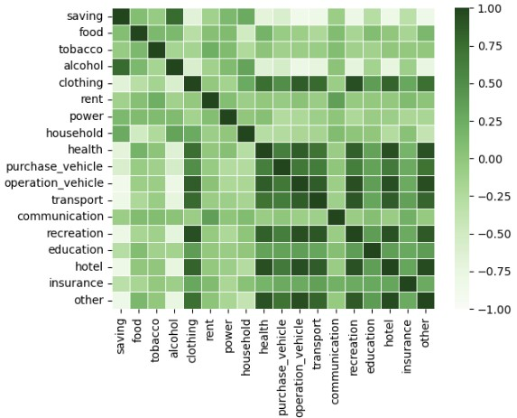
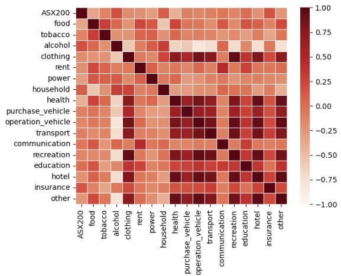

# Australian Household Consumption and Expenditure Pattern: A Discovery Study from 2012-2022
Prepared by Emma H, Kit N, Md Muhasenul H   *7 November 2022*
 
 ## Introduction
This discovery study seeks to uncover the Australian Household consumption and expenditure pattern. Specifically, we examine:
* Where do Australian spend their money?
* How has the consumption pattern changed over the period from January 2012 to June 2022?
* Is there any relationship between key economic indicators such as unemployment and household saving, and household consumption?
* Is there any relationship between ASX 200 price movements and household consumption?  

We further explore if there is any possbile Covid pandemic stimulated changes in consumption pattern. Extra care has been taken when interpreting the time series analysis results. 

## Data Used
The following data has been used in the study:
* Australian household final consumption and expenditure quarterly seasonally adjusted chain volume measures published by the Australian Bureau of Statistics (ABS)
* Australia monthly seaosonally adjusted unemployment rate published by the ABS
* Australia quarterly seasonally adjusted household saving ratio published by the ABS
* Australian Stock Market Index data collected using the Yahoo Finance API.

Chain volume measure is chosen as it measures consumption volumes by removing the part inflated by price increases. This metric also referred as constant price estimates. It provides better indication of movement in expenditure.

Seasonally adjusted data are used to better reflect the true patterns in the underlying consumption given the data has been modified to eliminate the effect of seasonal and calendar influences.

### Data Checking and Cleaning
The following summarises the key steps taken to source, extract, clean and explore data:
* **Sourcing data:** Economic related data are sourced from ABS. We have used panda's read_csv method to read, review and filter the data. ASX data was sourced from Yahoo Finance using API yfinance library. Date column is set as dataframe index.

* **Checking data quality:**  We check if there is any missing, null or duplicated value, using the ".isnull.sum()", ".duplicated()" and ".info" method. The data is of good quality. Minimal data correction is required.

* **Checking data frequency:** The datasets  are of different frequency, some are daily, some are quarterly.  When setting data as the dataframe index, we use parameters, such as "index_col, "dayfirst", "parse_dates" and "infer_datetime_format, " to allow our data frames share consistent date format. 

### Data Exploration
**Economic data:** Intuitively, some key economic indicators may be correlated to each other. The matrix below summarises correlation coeffficient between each variables.   
We observe that unemployment and housing saving has a strong positive correlation, changes in Australian cash rate target is weakly negative correlated with unemployment and household saving. 

**Unemployment data:** We have unemployment at the national level as well as at state and terrorities level. We run basic statistic analysis using by functions such as ".describe", ".max" , "idxmax", 'min', and 'idxmin'. From the line plot, we found that NSW, VIC and QLD unemployment trend are relatively similar to each other. ACT has the lowest unemployment in most years. 

**Household saving and spending** 
Household spending is split into 16 categories. The table list the categories and the corresponding label used to represent in the category in charts in the following section.

| Spending Category | Label |
|-------------------|-------|
| Food | Food |
| Cigarettes and tobacco | Tobacco |
| Alcoholic beverages | Alcohol |
| Clothing and footwear | Clothing |
| Rent and other dwelling services | Rent |
| Electricity, gas and other fuel  | Power|
| Furnishings and household equipment | Household |
| Health | Health |
| Purchase of vehicles | Purchase_vehicle |
| Operation of vehicles | Operation_vehicle |
| Transport services | Transport |
| Communications | Communication |
| Recreation and culture | Recreation |
| Hotels, cafes and restaurants | Hotel |
| Insurance and other financial services | Insurance |
| Other goods and services | Other |

We calculate the changes in consumption for each category using "pct_change()".

* **Aggregating data:** Monthly or quarterly data are aggregated using ""groupby(df.index.year).means()". The household spending data is in absolute amount. We deduce spending percentage for each category using a lambda function (i.e. "(lambda x: round(100 * x / df_mean.sum(axis = 1),2))". 

* **Visualising data trend and pattern:** Matplotlib, hvplot and seaborn libraries are used to explore and help visualise data trend and pattern. We mostly use line plot and bar plot. Pie chart is used to present the proportion spend on each category. Seaborn library is used to visualise relationship between consumption pattern and economic indicators, and ASX 200 returns. 

### Key observations and findings
#### Where do Australian spend their money?

  
In 2022, the top 3 category that Australians spend on are:  
* Rent
* Recreation
* Food

#### How has the consumption pattern changed over time?

We observe year on year increase in household consumption and expenditure from 2012 - 2018. The increase in household spending seem to be plateauing between 2018 and 2019. As the Covid pandemic hits (late Q1 2020), we observe a significant drop in the household expenditure. This is likely driven by the mandatory lockdown and travel restrictions imposed across all states. As we emerge from pandemic, we see a steep increase in household spending.

The following barplot shows the ten year trend for each spending category.

#### Relationship between unemployment and household consumption pattern

**Hypothesis:** As unemployment increases, the expected spending pattern are:
* spending on discretionary items are likely to decrease and
* spending on necessities are likely to remain unchanged.

**Results:** The calculated correlation coefficients between unemployment and spending pattern in each category largely agree with the hypothesis. We observed that spending on tobacco and alcohol tend to increase when unemployment increase. 

#### Relationship between household saving and household consumption pattern

**Hypothesis:** Increase in saving means less spending in absolute dollar terms. The expected spending patterns are:
* spending on discretionary items are likely to decrease and 
* spending on necessities remains largely unchanged.

**Results:** The calculated correlation coefficients between household saving and spending pattern in each category largely agree with the hypothesis. However, an unexpected observation is that there is a positive correlation between saving and spending on alcohol. 

#### Relationship between ASX 200 and household consumption pattern

**Hypothesis:** There is no relationship between ASX 200 returns and household consumption pattern.

**Results:** The calculated correlation coefficients between ASX 200 returns and spending pattern in each category supports the hypothesis.

### Future Development
With the findings from this discovery study, we recommend the following for future development:
* There is an obvious decreasing trend in tobacco spending. What are the likely drivers of this decreasing trend?
 
* Enhance the granularity of this study including explore further some of the unexpected observations.

* States and territories specific study specifically explore if there is any differences in consumption pattern between states and territories.
  
### References
* ABS Household Final Consumption and Expenditure (including household saving): https://www.abs.gov.au/statistics/economy/national-accounts/australian-national-accounts-national-income-expenditure-and-product/latest-release
* ABS Unemployment Rate: https://www.abs.gov.au/statistics/labour/employment-and-unemployment/labour-force-australia/latest-release
* Yahoo Finance API: https://pypi.org/project/yfinance/

